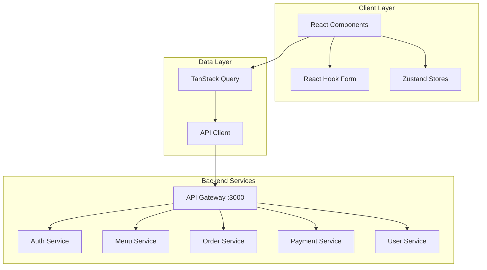

# Design Document: Frontend Phase 1 MVP

## Overview

این سند طراحی فاز 1 (MVP) فرانت‌اند سامانه کترینگ سازمانی را شرح می‌دهد. این فاز شامل احراز هویت، منوی روزانه، سبد خرید، پرداخت، تاریخچه سفارشات و پروفایل کاربر است.

### Technology Stack
- **Framework**: Next.js 14 (App Router)
- **Language**: TypeScript
- **Styling**: Tailwind CSS + Radix UI
- **State Management**: Zustand (client state) + TanStack Query (server state)
- **Forms**: React Hook Form + Zod
- **HTTP Client**: Axios
- **Date Handling**: jalali-moment (Persian calendar)

## Architecture

### Application Structure

```
frontend/src/
├── app/                    # Next.js App Router pages
│   ├── (auth)/            # Auth group (login, register, forgot-password)
│   ├── (dashboard)/       # Protected routes with layout
│   └── layout.tsx         # Root layout with providers
├── components/
│   ├── ui/                # Reusable UI components
│   ├── forms/             # Form components
│   ├── layout/            # Layout components (Sidebar, Header)
│   └── shared/            # Shared components
├── lib/
│   ├── api/               # API client and service functions
│   ├── hooks/             # Custom React hooks
│   ├── stores/            # Zustand stores
│   ├── utils/             # Utility functions
│   └── types/             # TypeScript type definitions
└── styles/                # Global styles
```

### Data Flow Architecture



## Components and Interfaces

### 1. Authentication Components

#### LoginForm Component
```typescript
interface LoginFormProps {
  onSuccess?: () => void;
}

interface LoginFormData {
  email: string;
  password: string;
}

// Validation Schema (Zod)
const loginSchema = z.object({
  email: z.string()
    .min(1, 'ایمیل الزامی است')
    .email('فرمت ایمیل نامعتبر است'),
  password: z.string()
    .min(8, 'رمز عبور باید حداقل ۸ کاراکتر باشد'),
});
```

#### RegisterForm Component
```typescript
interface RegisterFormData {
  email: string;
  phone: string;
  password: string;
  confirmPassword: string;
  role: 'personal_user' | 'company_admin';
}

// Validation Schema
const registerSchema = z.object({
  email: z.string().email('فرمت ایمیل نامعتبر است'),
  phone: z.string().regex(/^09\d{9}$/, 'شماره موبایل باید با ۰۹ شروع شود'),
  password: z.string().min(8, 'رمز عبور باید حداقل ۸ کاراکتر باشد'),
  confirmPassword: z.string(),
  role: z.enum(['personal_user', 'company_admin']),
}).refine(data => data.password === data.confirmPassword, {
  message: 'رمز عبور و تکرار آن مطابقت ندارند',
  path: ['confirmPassword'],
});
```

### 2. Menu Components

#### FoodCard Component
```typescript
interface FoodCardProps {
  food: FoodItem;
  onAddToCart: (food: FoodItem) => void;
}

interface FoodItem {
  id: string;
  name: string;
  description: string;
  image?: string;
  basePrice: number;
  effectivePrice: number;
  remainingQuantity: number;
  attributes: {
    isVegetarian?: boolean;
    isSpicy?: boolean;
    allergens?: string[];
  };
  categoryId: string;
  categoryName: string;
}
```

#### MenuFilter Component
```typescript
interface MenuFilterProps {
  selectedMealType: MealType | 'all';
  onMealTypeChange: (type: MealType | 'all') => void;
}

type MealType = 'breakfast' | 'lunch' | 'dinner';
```

### 3. Cart Components

#### CartItem Component
```typescript
interface CartItemProps {
  item: CartItem;
  onQuantityChange: (quantity: number) => void;
  onRemove: () => void;
}

interface CartItem {
  foodId: string;
  foodName: string;
  quantity: number;
  unitPrice: number;
  image?: string;
  notes?: string;
}
```

#### CartSummary Component
```typescript
interface CartSummaryProps {
  subtotal: number;
  subsidyAmount: number;
  totalPayable: number;
  isEmployee: boolean;
}
```

### 4. Order Components

#### CheckoutStepper Component
```typescript
interface CheckoutStepperProps {
  currentStep: number;
  steps: CheckoutStep[];
}

interface CheckoutStep {
  id: number;
  title: string;
  isCompleted: boolean;
}

// Steps: 1. Address, 2. Date, 3. Summary, 4. Payment
```

#### OrderCard Component
```typescript
interface OrderCardProps {
  order: Order;
  onClick: () => void;
}

interface Order {
  id: string;
  orderNumber: string;
  status: OrderStatus;
  totalAmount: number;
  userPayable: number;
  subsidyAmount: number;
  deliveryDate: string;
  createdAt: string;
  items: OrderItem[];
}

type OrderStatus = 'pending' | 'confirmed' | 'preparing' | 'ready' | 'delivered' | 'cancelled';
```

#### OrderStatusBadge Component
```typescript
interface OrderStatusBadgeProps {
  status: OrderStatus;
}

const statusConfig: Record<OrderStatus, { label: string; className: string }> = {
  pending: { label: 'در انتظار تأیید', className: 'bg-yellow-100 text-yellow-800' },
  confirmed: { label: 'تأیید شده', className: 'bg-blue-100 text-blue-800' },
  preparing: { label: 'در حال آماده‌سازی', className: 'bg-orange-100 text-orange-800' },
  ready: { label: 'آماده تحویل', className: 'bg-purple-100 text-purple-800' },
  delivered: { label: 'تحویل داده شده', className: 'bg-green-100 text-green-800' },
  cancelled: { label: 'لغو شده', className: 'bg-red-100 text-red-800' },
};
```

### 5. Wallet Components

#### WalletBalance Component
```typescript
interface WalletBalanceProps {
  personalBalance: number;
  companyBalance?: number;
  isEmployee: boolean;
}
```

#### TransactionTable Component
```typescript
interface TransactionTableProps {
  transactions: Transaction[];
  isLoading: boolean;
}

interface Transaction {
  id: string;
  type: 'credit' | 'debit';
  amount: number;
  balanceBefore: number;
  balanceAfter: number;
  description: string;
  createdAt: string;
}
```

### 6. Profile Components

#### ProfileForm Component
```typescript
interface ProfileFormData {
  firstName: string;
  lastName: string;
  nationalCode: string;
  birthDate: string;
  gender: 'male' | 'female';
}
```

#### AddressForm Component
```typescript
interface AddressFormData {
  title: string;
  address: string;
  city: string;
  postalCode: string;
  latitude?: number;
  longitude?: number;
  isDefault: boolean;
}
```

## Data Models

### API Response Types

```typescript
// Generic API Response
interface ApiResponse<T> {
  success: boolean;
  data: T;
  message?: string;
}

// Paginated Response
interface PaginatedResponse<T> {
  data: T[];
  meta: {
    total: number;
    page: number;
    limit: number;
    totalPages: number;
  };
}

// Auth Response
interface AuthResponse {
  accessToken: string;
  refreshToken: string;
  user: User;
}

// User
interface User {
  id: string;
  email: string;
  phone?: string;
  firstName?: string;
  lastName?: string;
  role: UserRole;
  companyId?: string;
  companyName?: string;
}

type UserRole = 'super_admin' | 'catering_admin' | 'kitchen_staff' | 
                'company_admin' | 'employee' | 'personal_user';
```

### Store Interfaces

```typescript
// Auth Store
interface AuthState {
  user: User | null;
  accessToken: string | null;
  refreshToken: string | null;
  isAuthenticated: boolean;
  login: (user: User, accessToken: string, refreshToken: string) => void;
  logout: () => void;
  updateUser: (updates: Partial<User>) => void;
}

// Cart Store
interface CartState {
  items: CartItem[];
  addItem: (item: CartItem) => void;
  removeItem: (foodId: string) => void;
  updateQuantity: (foodId: string, quantity: number) => void;
  clearCart: () => void;
  getSubtotal: () => number;
  getTotalItems: () => number;
}
```

### API Endpoints

```typescript
// Auth API
const authApi = {
  login: (data: LoginFormData) => POST('/auth/login', data),
  register: (data: RegisterFormData) => POST('/auth/register', data),
  forgotPassword: (email: string) => POST('/auth/forgot-password', { email }),
  refreshToken: (refreshToken: string) => POST('/auth/refresh', { refreshToken }),
};

// Menu API
const menuApi = {
  getDailyMenu: (date?: string) => GET('/menu/daily', { date }),
  getCategories: () => GET('/menu/categories'),
};

// Order API
const orderApi = {
  create: (data: CreateOrderData) => POST('/orders', data),
  getMyOrders: (params: OrderQueryParams) => GET('/orders', params),
  getOrderById: (id: string) => GET(`/orders/${id}`),
};

// Cart API
const cartApi = {
  getCart: () => GET('/orders/cart'),
  addItem: (data: AddCartItemData) => POST('/orders/cart/items', data),
  updateItem: (id: string, quantity: number) => PUT(`/orders/cart/items/${id}`, { quantity }),
  removeItem: (id: string) => DELETE(`/orders/cart/items/${id}`),
};

// Payment API
const paymentApi = {
  requestPayment: (data: PaymentRequestData) => POST('/payments/request', data),
  verifyPayment: (data: PaymentVerifyData) => POST('/payments/verify', data),
};

// Wallet API
const walletApi = {
  getBalance: () => GET('/wallets/balance'),
  getTransactions: (params: TransactionQueryParams) => GET('/wallets/transactions', params),
  topup: (amount: number) => POST('/wallets/topup', { amount }),
};

// User API
const userApi = {
  getProfile: () => GET('/users/profile'),
  updateProfile: (data: ProfileFormData) => PUT('/users/profile', data),
  getAddresses: () => GET('/users/addresses'),
  addAddress: (data: AddressFormData) => POST('/users/addresses', data),
  updateAddress: (id: string, data: AddressFormData) => PUT(`/users/addresses/${id}`, data),
  deleteAddress: (id: string) => DELETE(`/users/addresses/${id}`),
};
```

## Correctness Properties

*A property is a characteristic or behavior that should hold true across all valid executions of a system—essentially, a formal statement about what the system should do. Properties serve as the bridge between human-readable specifications and machine-verifiable correctness guarantees.*

### Property 1: Login Form Validation
*For any* string that is not a valid email format, the login form validation SHALL reject it with the error message "فرمت ایمیل نامعتبر است". *For any* password string shorter than 8 characters, the validation SHALL reject it with the error message "رمز عبور باید حداقل ۸ کاراکتر باشد".
**Validates: Requirements 1.6, 1.7**

### Property 2: Role-Based Redirect
*For any* authenticated user with a given role, the system SHALL redirect them to the correct dashboard path according to the role-to-path mapping.
**Validates: Requirements 1.3**

### Property 3: Phone Number Validation
*For any* string that does not match the pattern /^09\d{9}$/, the registration form validation SHALL reject it with the error message "شماره موبایل باید با ۰۹ شروع شود".
**Validates: Requirements 2.4**

### Property 4: Password Match Validation
*For any* pair of password and confirmPassword strings where password !== confirmPassword, the registration form validation SHALL reject with the error message "رمز عبور و تکرار آن مطابقت ندارند".
**Validates: Requirements 2.5**

### Property 5: Persian Date Formatting
*For any* valid JavaScript Date object, the formatPersianDate function SHALL return a string in Persian (Shamsi) calendar format.
**Validates: Requirements 11.2**

### Property 6: Food Item Display Completeness
*For any* FoodItem object, the FoodCard component SHALL render all required fields: name, price, and remaining quantity indicator.
**Validates: Requirements 4.4**

### Property 7: Cart Item Addition
*For any* FoodItem added to an empty cart, the cart SHALL contain exactly one item with quantity 1. *For any* FoodItem added to a cart that already contains that item, the item's quantity SHALL be incremented by 1.
**Validates: Requirements 5.1, 5.2**

### Property 8: Cart Persistence Round-Trip
*For any* cart state, after persisting to localStorage and reloading, the cart state SHALL be equivalent to the original state.
**Validates: Requirements 5.3**

### Property 9: Cart Total Calculation
*For any* cart with items, the subtotal SHALL equal the sum of (unitPrice × quantity) for all items.
**Validates: Requirements 5.5, 5.7**

### Property 10: Order Summary Calculation
*For any* order with items, the order summary SHALL display the correct subtotal, subsidy amount (if applicable), and total payable amount where totalPayable = subtotal - subsidyAmount.
**Validates: Requirements 6.4**

### Property 11: Order Display with Status Badges
*For any* Order object, the OrderCard component SHALL display the order number, date, total amount, and a status badge with the correct color according to the statusConfig mapping.
**Validates: Requirements 7.3, 7.4**

### Property 12: Wallet Balance Display
*For any* user, the wallet page SHALL display their current balance. *For any* employee user, the wallet page SHALL display both personal and company balances separately.
**Validates: Requirements 8.1, 8.2**

### Property 13: Transaction History Display
*For any* Transaction object, the transaction table SHALL display: type, amount, balance before, balance after, description, and date.
**Validates: Requirements 8.3**

### Property 14: Price Formatting
*For any* numeric amount, the formatPrice function SHALL return a string in Persian number format with "تومان" suffix.
**Validates: Requirements 8.6, 11.4**

### Property 15: Route Protection
*For any* protected route and unauthenticated user, the system SHALL redirect to the login page. *For any* authenticated user accessing a route outside their role permissions, the system SHALL redirect to their default dashboard.
**Validates: Requirements 10.1, 10.2**

## Error Handling

### API Error Handling
```typescript
// Error Response Type
interface ApiError {
  success: false;
  error: {
    code: string;
    message: string;
    details?: Record<string, string[]>;
  };
}

// Error Handler
const handleApiError = (error: AxiosError<ApiError>) => {
  if (error.response?.data?.error) {
    const { message, details } = error.response.data.error;
    
    // Show toast with Persian message
    toast.error(message);
    
    // Return field errors for form validation
    return details;
  }
  
  // Network or unknown error
  toast.error('خطا در برقراری ارتباط با سرور');
  return null;
};
```

### Form Validation Errors
- All validation messages are in Persian
- Field-level errors displayed below each input
- Form-level errors displayed at the top of the form

### Authentication Errors
- 401 Unauthorized: Attempt token refresh, then redirect to login
- 403 Forbidden: Display "دسترسی غیرمجاز" and redirect to appropriate dashboard

## Testing Strategy

### Unit Tests
- Test utility functions (formatPrice, formatPersianDate, validators)
- Test Zustand store actions and selectors
- Test form validation schemas

### Property-Based Tests
Using `fast-check` library for property-based testing:
- Minimum 100 iterations per property test
- Each test tagged with: **Feature: frontend-phase1-mvp, Property {number}: {property_text}**

### Integration Tests
- Test API client functions with mocked responses
- Test form submission flows
- Test authentication flow (login, logout, token refresh)

### E2E Tests (Optional)
- Test complete user flows using Playwright
- Test responsive design breakpoints
